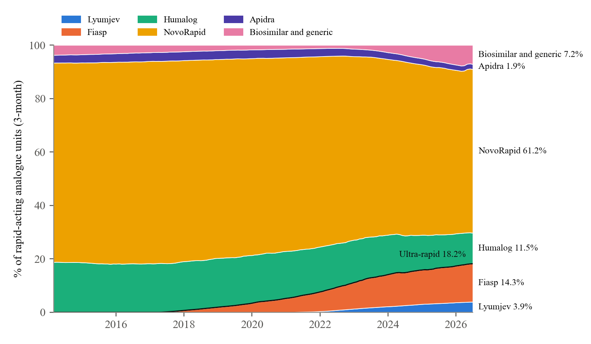
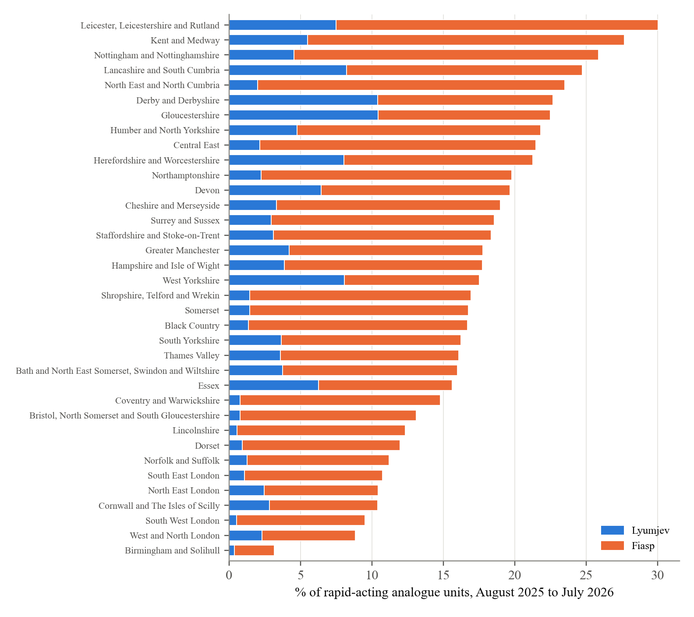
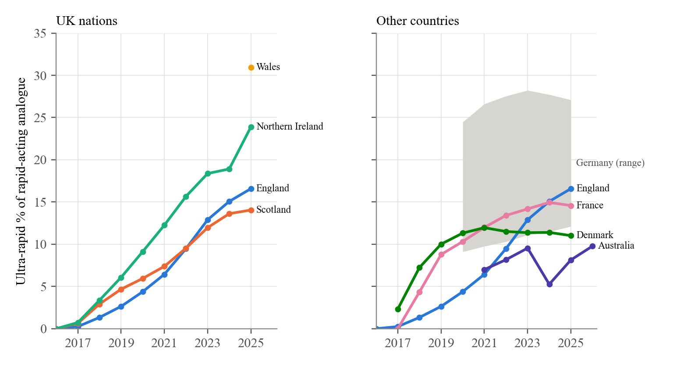

# Losing Lyumjev: how the system let its patients down

*The usual preamble. This is analysis of published prescribing data, published trials and public
statements, not advice about which insulin anyone should use. The full method, every number and the
code that produces them are in the preprint and its repository, linked at the end.*

---

In March 2026 a pump user in Switzerland went to order more Lyumjev and was told it could not be
ordered. "There's no press release, pharmacy just says they can't order it anymore due to being
discontinued," they wrote on Reddit. Lilly had told Swiss specialists the previous autumn. It had not
told the national patient organisation, which found out from a copy passed to it unofficially.

Switzerland was the first. In March 2026 Lilly announced that it would stop selling selected
presentations of its insulins in selected European countries before 2027, and Lyumjev, its ultra
rapid insulin lispro, is on the list. The formal reason is "commercial". The reason given closer to
the ground is that not many people used it.

That is true, and it is the subject of this piece. Lyumjev was not used much because the system that
decides which insulins people are offered did not offer it, including in the years when it cost the
NHS nothing extra to do so. People with diabetes are now losing an insulin on the grounds of low
demand that prescribers, formulary committees and guideline writers created.

I should say where I stand. I have used the fastest mealtime insulin available since each one reached
the UK, some of the time on private prescription, because I read the pharmacology and the trials and
decided that an insulin which starts working sooner was worth having.

## What is being lost

Neither Lyumjev nor Fiasp, Novo Nordisk's faster aspart, has lost its EU licence. Their
presentations are going country by country. Lyumjev cartridges have gone in France and Belgium, its
200 unit and Junior KwikPens in Norway, and its vial, cartridges and standard KwikPen in Switzerland.
Germany has kept Lyumjev but dropped its five-pen packs. The Lyumjev Tempo Pen was removed from the EU
licence in July 2026. On the Novo Nordisk side, the Fiasp PumpCart, a prefilled cartridge for the
YpsoPump, is being withdrawn across the whole EU by the end of 2026.

The official statements are brief. The European Medicines Agency says Lilly "decided to stop
marketing some of its insulin medicines for commercial reasons", and that the decision "is not related
to a quality defect or safety issue". Lilly's template letter to European clinicians says the decision
followed "careful consideration and a thorough market assessment". In France, Lilly said it was
rationalising its insulin range worldwide to "maintain a continuous and reliable supply of the
insulins most commonly used by patients".

Lower down, the reason becomes specific. Norway's diabetes association, reporting the loss of the two
Lyumjev pens there, wrote that Lilly "points out that these are variants that are little used". In
Switzerland, the patient organisation diabetesschweiz complained, and in March 2026 passed on what it
had been told, which it was careful to call unofficial: that very few people in Switzerland had stayed
on Lyumjev long term, partly because of pain or burning at injection, and that specialist prescribing
had been very low.

The UK has had no announcement. The NHS medicines dictionary marks only the Lyumjev Tempo Pen as
discontinued, and Lilly's March notice covers the EU and EEA. But the UK uses Lyumjev at the same low
rate as France, which has already lost the cartridges, and Lilly has not said what it plans here.

## Why Lyumjev matters

Every rapid-acting insulin has the same problem. Food starts raising glucose within minutes, and an
injected insulin takes a good deal longer to get going. That is why we are told to inject 15 to 20
minutes before eating, and why so many post-meal spikes look the way they do. In practice most people
do not wait. A Spanish study using connected pen caps recorded 775 evenings from 49 people, and in
52.6% of them the dinner insulin went in during the 45 minutes after the glucose rise from the meal
had already started.

The ultra-rapid insulins change the first half hour. Fiasp appears in the blood about five minutes
earlier than NovoRapid. Lyumjev adds citrate and treprostinil to lispro, which open up the local blood
vessels, and has several times Humalog's exposure in the first quarter of an hour. In the trials'
meal tests, the rise in glucose an hour after eating was about 0.9 to 1.6 mmol/L lower than with the
older insulins.

Lyumjev is the faster of the two, and people who have used both say so. In a crossover study of all
four insulins, Lyumjev reached half its early peak concentration six minutes before Fiasp. In the
Cambridge closed-loop system, Fiasp added no time in range over standard aspart, while Lyumjev added
2.5 percentage points over standard lispro, and a pooled analysis of meals in that system found
Lyumjev improved the four hours after breakfast where Fiasp made no measurable difference.

What people value is not having to wait. "Lyumjev is faster for me, I don't pre-bolus now and I just
feel much more confident with it," wrote a Diabetes UK forum member in 2021. A Swiss pump user wrote
in 2026 that "Lyumjev worked extremely well with Control-IQ because of the faster pharmacokinetics. It
noticeably improved post-meal spikes compared with standard lispro."

It does not suit everyone. Site pain is the common complaint, especially on pumps. In the Lyumjev pump
trial, infusion-site reactions occurred in 19.1% of people against 6.9% on Humalog, and of 29 people
whose earlier public accounts I collected, nine described pain or site reactions, seven of them with
Lyumjev. "Burning, painful infusion sites that left lumps several days after," one t:slim user wrote
in March 2026. That is a reason to offer a choice: Lyumjev suits some people and hurts others.

## How little it is used

England publishes every prescription dispensed in the community. In the year to July 2026, Lyumjev
was 3.7% of the rapid-acting analogue insulin dispensed in English primary care, six years after it
arrived. Its share of lispro has grown every year, to 24% in 2026, but most people in England use
aspart, and Lyumjev is a lispro. Fiasp, faster aspart, adds 13.9%, so the two ultra-rapid insulins
together are 17.5%. The other 82.5%, or 2.74 million prescription items a year, is one of the older,
slower products.

Where people live decides a great deal. Between English integrated care boards the ultra-rapid share
ranges from 3.2% in Birmingham and Solihull to 30.0% in Leicester, Leicestershire and Rutland. Across
the UK nations it is 14.7% in Scotland, 17.4% in England, 26.4% in Northern Ireland and 32.8% in Wales,
and in one Welsh health board, Cwm Taf Morgannwg, it is 56.3%. Lyumjev alone is 6.0% of units in both
Wales and Northern Ireland, against 3.7% in England and 3.4% in Scotland.

England is not unusual internationally. France was at 14.3% in the year to June 2026 and Denmark at
11.0% in 2025; both rose faster than England at first and then stopped at around 11% to 15%. The
spread inside the UK is wider than the spread between countries, which is the first sign that the
low figure is a choice made locally.

## How the system kept it there

### The trials and the guidelines

Every head-to-head trial of Fiasp or Lyumjev against its parent insulin used HbA1c as its main
outcome and tested whether the new insulin was no worse. They all passed. Pooled across nine trials,
the difference in HbA1c was 0.02 percentage points. The post-meal benefit was there, but as a
secondary result.

That design is enough to license an insulin and gives prescribers little reason to use it. HbA1c is
what guidance, audits and incentive schemes look at, and "no different on HbA1c" gives a busy
clinician no prompt to switch anyone. NICE's guidance for adults with type 1 diabetes recommends
rapid-acting analogues as a class, names no product, and has not been reviewed on this point since
2015. At no point did national guidance tell prescribers that the faster insulins were worth offering.

### Formularies

Each area has a formulary that sets which insulins are first choice. I read the entries for Lyumjev
in 38 areas across the UK: 17 English integrated care boards, 13 Scottish health boards, all seven
Welsh health boards and Northern Ireland. Lyumjev was open to any prescriber in five of them. In eight
it needed a specialist or set clinical criteria. In twelve it was placed behind another insulin, as a
second or third choice or only after the standard insulin had failed. In thirteen it was not on the
formulary at all, including eight of the thirteen Scottish boards and Northern Ireland.

Across both ultra-rapid insulins, the English pattern is clear. Where formularies left them open, the
median ultra-rapid share was 26.8%; where they were second line, restricted to pregnancy or not
listed, it was 9.5%. Birmingham and Solihull, the lowest in England, allows Fiasp only in pregnancy
"after other insulins have been tried and failed" and does not list Lyumjev. Scotland shows the same
direction: the two boards using the Highland Formulary, which lists both products without
restriction, are at 26.2% and 23.5%, while the rest have a median of 5.2%.

Formularies are not the whole story. Wales has high uptake under every kind of entry, and Northern Ireland dispenses Lyumjev at 1.6 times the English rate without listing it, so local specialist
practice matters as well. But a formulary that leaves an insulin off, or puts it behind the one most
people are already on, steers every prescriber in the area away from it.

### Cost before biosimilars

The decision to keep people on the slower insulins was not made to save money, because for most of
the period there was no money to save.

Lyumjev has cost English primary care slightly less per unit than Humalog in every year since it
arrived: £1.85 against £1.89 per 100 units in 2026, £1.74 against £1.77 in 2022. Its list price per
box is the same as Humalog's. Fiasp was the same story against NovoRapid. For the 52 months between
Fiasp's arrival in February 2017 and the first biosimilar, Trurapi, in June 2021, English primary care
paid £1.68 per 100 units of Fiasp against £1.76 for NovoRapid.

In those 52 months, 10.1 million prescription items of standard-speed rapid-acting insulin were
dispensed in England, and more than 97 prescriptions in every 100 stayed on the older insulin. Some of
that was formulary committees actively keeping the faster insulins out. North Central London recorded
Fiasp as "Not approved for: Adults with Type 1 diabetes" in November 2018. Birmingham and Solihull
restricted it to pregnancy in June 2019. South East London made it a second-line option in January
2020. None of those decisions could have been about cost.

It was not only committees. In June 2017, four months after Fiasp arrived, people on the
diabetes.co.uk forum were describing what happened when they asked for it. One was given "a straight
'No'" by a diabetes consultant: "Apparently I am too well controlled to change anything!" A pump user
was told "no your a1c is low enough as it is, we don't want it going any lower!!" and got it only after
arguing. Another had been told by a consultant and a specialist nurse that Fiasp "is still undergoing
trials, and is not available on their formulary", and after three or four attempts had got nowhere.
A specialist nurse told another that their clinic would move only NovoRapid users across, because
"they don't think there is much difference between Humalog and Fiasp". I wrote in the same thread at
the time that "Many HCPs will not prescribe it until they see the outcome of this trial because they
don't want to get in to trouble for prescribing something they don't have details of."

People told me at the time that some consultants in England went further and said they did not
believe a faster insulin offered any benefit, and would not prescribe Fiasp for that reason. I did
not hear that said myself, so I report it as hearsay; the nurse's view that there was not "much
difference" is the documented version. That is a clinical judgement made against the trials' own meal-test results
and against what the people asking for it were saying, and in the years when it cost nothing to let
them try.

Most of it was inaction. A prescriber renewing a NovoRapid or Humalog prescription had, at the same
price or a little less, an insulin that let people eat without waiting, and almost every time the
prescription stayed as it was. Hospital diabetes teams, which prescribe the faster insulins at twice
the GP rate, still started most people on the older ones. The quality-of-life case was available from
the start, in the trials' own meal tests and in what people were saying, and the system did not act
on it while acting on it was free.

### Cost after biosimilars

From 2021 there was a cheaper insulin to protect. Trurapi and the other biosimilars are about 30%
cheaper than NovoRapid and work at the same speed. Norfolk and Waveney estimated that moving 80% of
people from NovoRapid to Trurapi would save about £340,000 a year, and Cheshire and Merseyside about
£1 million. Dorset now pays primary care networks to get biosimilar aspart above half of all aspart
prescribing. Those documents exclude Fiasp from the switch, but once Trurapi is first choice an
ultra-rapid insulin becomes a second step, and the trial evidence gives that step little to stand on.
Trurapi reached 7.5% of units within five years. Lyumjev, after six, is at 3.7%. By then the period in
which the faster insulins could have become the default at no extra cost was over.

## What "commercial reasons" means in money

In England, primary care spent £5.6 million on Lyumjev in the year to July 2026, against £18.3 million
on Humalog. In France it was €6.4 million against €49.3 million. In the US Medicare drug programme
Lyumjev took $90 million in 2024, against $664 million for Humalog. These are what payers spent at list
or reimbursement prices, which is not the same as Lilly's income, but they show the scale: Lyumjev is
between a tenth and a quarter of Lilly's rapid-acting insulin business in each of these markets.

Lilly's total revenue in the first three months of 2026 was $19.8 billion, $12.8 billion of it from
Mounjaro and Zepbound. Its quarterly report does not list its insulins separately; they sit in a line
marked "Other". A product worth a few million a year in each European country, with low use, is an
easy line to cut for a company in that position. The low use is in large part something the system
created.

## What people are saying

I collected 31 public posts from people with diabetes across Europe, and 11 statements from companies,
regulators and patient groups, from 2025 and 2026. Every quote below was checked word for word against
a saved copy of the original. I have given platform, country and month, without names.

The sharpest reaction is from Switzerland, where Lyumjev went first. "Not cool that the best insulin
for tslim gets discontinued by the manufacturer - also without any sort of proper announcement"
(Reddit, Switzerland, March 2026). "Why was my favorite insulin (Lyumjev) pulled from the Swiss
market?" (Reddit, Switzerland, April 2026). "I am from Switzerland and currently use my very last
Lyumjev pen" (Reddit, July 2026).

A recurring suspicion is that insulin is being sidelined for weight-loss drugs: "Lyumjev is handsdown
the best insulin on the market at this time, its a shame Eli Lilly wants to take it away from many
people so they can focus on more profitable endeavours such as Mounjaro" (Reddit, May 2026). Another
person wrote: "It's such a quality of life issue" (Reddit, September 2026). In the UK the mood is
uncertainty: "Doesn't look like they've said anything about withdrawing Lyumjev in the UK, just
EU/EEA, so hopefully they keep it here, but does seem worrying" (Reddit, UK, July 2026).

Not everyone is sorry, and that should be said. The site pain comes up again, and Norway's diabetes
association quoted a professor saying there are good alternatives to every insulin being withdrawn
there. In the Czech Republic, where Lilly said supplies were continuing, the national regulator
reported in July 2025 that Lyumjev deliveries had risen by 20% in a year, driven by pump users
including children. There, at least, demand grew where people were offered it.

## What comes next

The loss matters most where closed loop is heading. A fully closed loop, with no meal boluses at all,
has to catch a meal from the glucose rise alone, and the faster its insulin acts the less of the rise
it misses. Both fully closed-loop systems tested in UK trials were run on ultra-rapid insulin, Lyumjev
in adults and Fiasp in adolescents. The authors of a UK trial comparing Lyumjev with standard lispro
in fully closed loop concluded that "Further advancements in faster-acting insulins are needed to
alleviate the burden of pre-meal bolusing and enhance fully closed-loop performance in the future."
As one person put it in September 2026: "every minute counts with a system working on a time offset."

What is happening in Europe runs the other way. Pump presentations are among the losses: the Fiasp
PumpCart across the EU, Lyumjev vials and cartridges in some countries. Pump users can still fill
reservoirs from Fiasp vials, as the German Diabetes Society has pointed out. But the fastest insulin
available is going country by country, with low use given as the reason in Norway and Switzerland, as
fully closed loop is starting to need it.

The UK still has every Lyumjev presentation except the Tempo Pen. Whether it keeps them will depend on
a commercial judgement in which the UK's own low use counts against it.

## What I take from this

None of the reasons Lyumjev was so little used rests on evidence that the older insulins are better.
Each one is a default that left them in place: trials built to show equivalence on the measure
everyone watches, guidance that never named the faster insulins, formularies that left Lyumjev off or
put it behind the insulin people were already on, and cost programmes that made a cheaper slow insulin
the first choice once there was one.

The part I find hardest to accept is the years when switching was free. The faster insulins cost the
NHS no more than the ones they would have replaced, and the system moved less than 3% of rapid-acting
insulin onto them. That was a quality-of-life gain available at no cost. The people who missed it were
prescribers and formulary committees; the people who would have benefited were mostly never offered
it. Now the low use that followed is being given as a reason to take the insulin away.

Wales shows it did not have to go this way. Across a whole nation a third of rapid-acting insulin is
ultra-rapid, and in one health board more than half. I cannot tell from these data exactly why Wales
is different, and it is the question I would most like answered while UK patients still have
Lyumjev.

## The limits

These are dispensing data. They show what was supplied, which includes stock held at home that has
not yet been injected.

The comparison between countries mixes different kinds of data. France and Denmark are national
dispensing in units; Australia counts subsidised prescriptions only and cannot include Lyumjev; the
US figures cover only two public programmes; Germany is a range.

The spending figures are what payers spent at list or reimbursement prices. They are not Lilly's
revenue. The most specific statements about low use come second hand, through a patient organisation
in Norway and in Switzerland.

The formulary reading was done by one person who had already seen the uptake figures, the English
pattern is confounded by geography (three of the five most restrictive ICBs are in London), and
formulary wording does not explain the Welsh figures or the low Scottish boards, so part of what
drives the variation is not measured here.

The user accounts and community posts are self-selected and show the range of experience. They
cannot say how common any of it is.

The preprint, with the full method, all references and the formulary wording area by area, is at
[Zenodo DOI to be added]. The code and outputs behind every number are at
https://github.com/tim2000s/rapid-insulin-prescribing.
